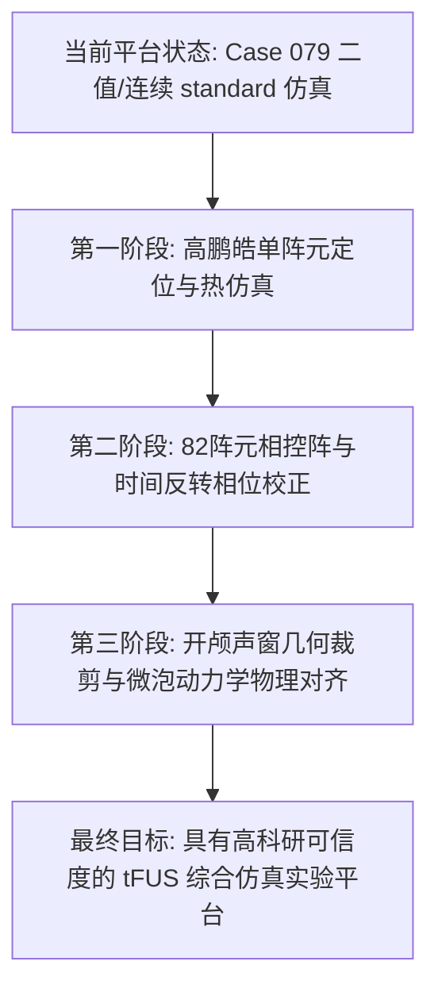

# 本地论文实验步骤与最终输出复刻规划蓝图

本规划书旨在将三篇本地种子论文（高鹏皓 2022、潘婷 2021、孙天宇 2021）的核心仿真实验流程、算法及图表输出，完全转化为 `fus-sim` 仿真平台的功能开发路线。我们的最终目标是使本平台具备运行这三篇论文全部实验并生成一致科研报告与定量图表的能力。

---

## 🚀 模块一：高鹏皓论文（2022）——单阵元定位扫查与热学安全复刻

### 1.1 核心仿真参数与模型定义
*   **换能器规格**：单阵元凹球面换能器，曲率半径 $R = 30\text{ mm}$，开口直径 $D = 25\text{ mm}$（F数 = 1.2），中心频率 $f = 500\text{ kHz}$，表面激励声压 $p_{source} = 1.0\text{ MPa}$。
*   **声学介质属性**：
    *   水：$c = 1500\text{ m/s}$，$\rho = 1000\text{ kg/m}^3$，$\alpha = 0$
    *   脑组织：$c = 1540\text{ m/s}$，$\rho = 1040\text{ kg/m}^3$，$\alpha = 0.6\text{ dB/MHz/cm}$
    *   颅骨（二值）：$c = 2800\text{ m/s}$，$\rho = 1900\text{ kg/m}^3$，$\alpha = 8.0\text{ dB/MHz/cm}$
*   **热学介质属性**：
    *   热导率 $K$：脑 = 0.51 W/m/K，骨 = 0.43 W/m/K
    *   比热容 $C_p$：脑 = 3700 J/kg/K，骨 = 1300 J/kg/K
    *   血液灌注率 $W_b$：脑 = 8.3 kg/m³/s，骨 = 0.5 kg/m³/s
    *   血液比热容 $C_b = 3800\text{ J/kg/K}$，动脉血温 $T_{art} = 37^\circ\text{C}$

### 1.2 核心算法一：换能器空间扫查定位算法
*   **算法目的**：自动在海马体靶点（Target）外围寻找使靶点处声压最高的换能器物理放置点。
*   **计算步骤**：
    1.  **确定规划范围**：以靶点坐标 $\mathbf{x}_{target}$ 为球心，换能器焦距（曲率半径）$R = 30\text{ mm}$ 为半径，在颞骨窗合理入射角度范围内（如极角 $\theta \in [0^\circ, 45^\circ]$，方位角 $\phi \in [-30^\circ, 30^\circ]$）生成三维候选换能器中心点点阵 $\mathbf{X}_{candidate}$。
    2.  **碰撞干涉过滤**：遍历每个候选点，生成碗状换能器的三维几何掩膜（Mask）。如果换能器实体侵入颅骨内侧或超出仿真边界，则在候选列表中剔除该点。
    3.  **批量快速声场评估**：使用较低分辨率（如 `quick` 预置）或大网格离散，将 bowl source 逐个放置在保留的候选点上，朝向对准 $\mathbf{x}_{target}$ 运行仿真。
    4.  **定位判定**：记录仿真中靶点 $\mathbf{x}_{target}$ 处的峰值压力 $p_{target}$。选取 $p_{target}$ 最大的候选位置作为最佳安装中心点。
*   **复刻输出图表**：
    *   `candidate_grid.png`：三维空间中候选换能器点阵、颅骨几何与靶点的相对位置可视化。
    *   `pressure_vs_position.png`：靶点声压随换能器平移偏角/偏距的变化曲线。

### 1.3 核心算法二：Pennes 生物热动力学与降温阶段仿真
*   **计算步骤**：
    1.  **吸收产热项计算**：由最佳定位声场仿真的三维最大声压场 $p_{max}(\mathbf{x})$ 得到声强 $I(\mathbf{x}) = \frac{p_{max}^2}{2\rho c}$。计算单位体积热源项：
        $$Q(\mathbf{x}) = 2 \alpha_{\text{Np/m}}(\mathbf{x}) \cdot I(\mathbf{x})$$
        其中吸收系数需转换为 $\text{Np/m}$（$\alpha_{\text{Np/m}} = \alpha_{\text{dB/MHz/cm}} \times 100 \times 0.115$）。
    2.  **升温阶段数值求解**：设定初始温度场为均匀 $37^\circ\text{C}$。使用时域显式差分法（FDTD）求解 Pennes 传热方程：
        $$\rho C_p \frac{\partial T}{\partial t} = K \nabla^2 T - W_b C_b (T - 37) + Q_{met} + Q \cdot \text{Duty}$$
        设定仿真步长 $\Delta t_{thermal}$（通常可取 $0.1\text{ s}$ 级别）。运行超声开启时长（例如 $67\text{ ms}$ 或者持续 $5\text{ s}$）。
    3.  **冷却降温阶段**：撤除超声产热项（即设 $Q = 0$），继续迭代传热方程 $10\sim 20\text{ s}$，记录热量耗散与温度衰减过程。
*   **复刻输出图表**：
    *   `temperature_time_profile.png`：焦点、脑组织、颅骨最高温随时间（升温 + 降温阶段）的动态变化曲线（对齐高论文低于 42°C 安全限的图表）。
    *   `thermal_map_3d.png`：三维最大温升横切面和轴切面热图。

---

## 🌀 模块二：潘婷论文（2021）——相控阵 BBB 开放与微泡空化监测复刻

### 2.1 核心仿真参数与相控阵生成
*   **相控阵结构**：凹球面冠随机相控阵。开口直径 $100\text{ mm}$，曲率半径 $80\text{ mm}$，包含 $82$ 个圆形阵元（每个阵元半径 $4\text{ mm}$）。
*   **换能器阵元排布算法**：
    1.  在半径 $R=80\text{ mm}$ 的球面上采样随机点。
    2.  增加距离约束：任意两个阵元中心的三维欧氏距离必须大于阵元外径（$8\text{ mm}$），确保物理上不重叠。
    3.  生成 82 个圆盘传感器，将其法向均对准球面球心 $\mathbf{x}_{target}$。

### 2.2 核心算法一：相控阵时间反转（Time Reversal）穿颅相位校正
*   **算法目的**：消除声波穿过非均匀高声速颅骨引起的相位畸变，让多阵元能量在靶点处精准对齐。
*   **计算步骤**：
    1.  **正向点源激励**：在仿真网格的靶点位置 $\mathbf{x}_{target}$ 处放置一个虚拟单频点声源。
    2.  **穿颅传播记录**：运行三维 k-Wave，让点源发出的球面声波向外传播，穿过 CT 颅骨介质。在换能器的 $82$ 个阵元中心点上设置 sensor，记录各自接收到的声压波形 $p_i(t)$。
    3.  **相位延迟提取**：
        *   **时域法**：计算每个阵元接收到波形的互相关或包络峰值时间延迟 $\Delta t_i$。
        *   **频域法**：对每个 $p_i(t)$ 进行 FFT，提取工作频率 $f_0$ 处的复数相位角度 $\phi_i = \angle \mathcal{F}\{p_i(t)\}_{f=f_0}$。
    4.  **反向发射聚焦**：将提取出来的相位进行共轭反转，即第 $i$ 个阵元的激励初始相位设为 $\theta_i = -\phi_i$（或时域延迟发射）。此时从 82 个阵元同时向颅内发射，声波会在空间自动补偿颅骨畸变，并在 $\mathbf{x}_{target}$ 处形成高度聚焦。
*   **复刻输出图表**：
    *   `array_layout.png`：82阵元在球面冠上的随机分布 3D 投影图。
    *   `phase_correction_profile.png`：82个阵元的相位延迟分布柱状图。
    *   `corrected_vs_uncorrected_field.png`：校正前与校正后穿颅声场的焦域形状和压力剖线对比（展示旁瓣受到抑制，主瓣能量集中的效果）。

### 2.3 核心算法二：单微泡 Keller-Miksis 动力学与 PCD 回波分析
*   **计算步骤**：
    1.  **输入驱动声压**：由相控阵穿颅声场仿真，提取靶点焦点处的声压时间序列 $p_{drive}(t)$。
    2.  **RK4 数值求解微泡动力学**：编写龙格库塔解法器，求解考虑声辐射阻尼的 Keller-Miksis 方程：
        $$\left(1 - \frac{\dot{R}}{c_l}\right) R \ddot{R} + \frac{3}{2}\left(1 - \frac{\dot{R}}{3c_l}\right) \dot{R}^2 = \frac{1}{\rho_l} \left(1 + \frac{\dot{R}}{c_l} + \frac{R}{c_l} \frac{d}{dt}\right) \left[ P_g(R, \dot{R}) - p_{drive}(t) - P_0 \right]$$
        迭代输出微泡在超声周期下的瞬时半径曲线 $R(t)$。
    3.  **计算被动空化发射压力**：计算微泡径向振动向外辐射的次级声压（被动空化回波信号）：
        $p_{scatter}(t) = \frac{\rho_l}{d} \left( R^2 \ddot{R} + 2R\dot{R}^2 \right)$（其中 $d$ 为虚拟回波接收水听器距离焦点的距离）。
    4.  **频谱特征分析**：对 $p_{scatter}(t)$ 进行傅里叶变换，提取频域分布。
*   **复刻输出图表**：
    *   `bubble_radius_oscillation.png`：微泡半径随时间收缩与剧烈膨胀的 $R(t)/R_0$ 曲线。
    *   `pcd_spectrum.png`：回波信号的频谱图，清晰标示出基频（$f_0$）、次谐波（$0.5f_0$）、超谐波（$1.5f_0$）和宽带噪声基底。
    *   `MI_safety_envelope.png`：以机械指数 $MI \in [0.3, 0.7]$ 为安全界限的剂量窗口图。

---

## 🩸 模块三：孙天宇论文（2021）——脑血栓溶栓与开颅声窗对比复刻

### 3.1 核心仿真参数与溶栓声窗构建
*   **换能器规格**：采用与潘婷相同的 82 阵元凹球面相控阵模型，以便复用换能器生成逻辑。频率使用其较优区间（$0.8\text{ MHz}$），占空比使用 $10\%$。
*   **溶栓压力阈值**：有效溶栓阈值定为 $PNP = -6\text{ MPa}$，显著溶栓定为 $PNP = -8\text{ MPa}$。

### 3.2 核心算法一：开颅声窗模型几何裁剪算法
*   **算法目的**：模拟脑外科手术中切除特定大小圆形/方形颅骨声窗（Craniotomy bone window）后对超声穿透及能量的影响。
*   **计算步骤**：
    1.  **建立常规三维 CT 颅骨模型**：在三维空间中加载原始三维连续或二值模型。
    2.  **定义三维开孔窗几何体**：用户设定声窗中心坐标 $\mathbf{x}_{window}$、声窗直径 $D_{window}$（如 10mm, 20mm, 30mm）以及开窗法向矢量。生成一个三维圆柱/锥体掩膜 $M_{window}$。
    3.  **模型裁剪修改**：在声学模型生成器中，将与 $M_{window}$ 相交的颅骨体素属性强制重置为水/脑组织的值（即消除该区域骨结构）：
        $$\text{if } M_{window}(\mathbf{x}) == 1: \quad c(\mathbf{x}) = c_{water}, \quad \rho(\mathbf{x}) = \rho_{water}, \quad \alpha(\mathbf{x}) = \alpha_{water}$$
    4.  **声场求解与能量比对**：分别在“完整经颅模型”与“开颅声窗模型”下运行声场仿真。
*   **复刻输出图表**：
    *   `skull_craniotomy_model.png`：三维颅骨模型在手术开孔处的横截面几何图。
    *   `transcranial_vs_craniotomy_field.png`：完整穿颅声场与开孔声窗声场的声轴线声压剖面、焦斑形状及焦点前移/后退的对比。

---

## 🗺️ 平台开发路线实施蓝图

为了让您能够自主地在我们平台上跑通上述论文的所有实验，整个复刻路线建议分为以下三个迭代阶段：

### 🎯 阶段 1：实现单阵元定位搜参及 Pennes 热传导升降温模型（优先复刻高鹏皓2022）
1.  **新增换能器放置矩阵评估模块**：编写脚本 `plan_transducer_sweep.py`，实现依据靶点和曲率半径计算候选球面阵列，逐点调用并评估焦点声压。
2.  **新增 Pennes 热动力学解法器**：编写脚本 `simulate_pennes_bhte.py`，将三维声学产热项接入传热差分方程，支持设置刺激占空比、Sonication 时间、以及后续 15 秒的无激励降温冷却迭代。

### 🎯 阶段 2：实现 82 阵元随机相控阵与时间反转相位对齐（优先复刻潘婷/孙天宇相控阵）
1.  **新增 82 阵元球面随机分布排布器**：编写 `build_phased_array_source.py` 生成几何约束下的阵元坐标和法向。
2.  **实现时域/频域时间反转相位校正**：编写 `calculate_time_reversal.py`，在几何焦点放置虚拟单频源进行反向传输，捕获 82 个阵元的声压时间信号并计算其共轭相位差，最后作为发射参数回授给仿真器运行穿颅聚焦。

### 🎯 阶段 3：实现开颅骨窗裁剪与单微泡 Keller-Miksis 求解
1.  **新增骨窗裁剪函数**：在 CT 声学建模中提供圆形切片裁剪接口。
2.  **编写微泡 RK4 动力学求解器**：编写 `simulate_microbubble_dynamics.py`，输入焦点时域波形，输出微泡 $R(t)$ 以及二次发射声压的 FFT PCD 回波频谱图。
