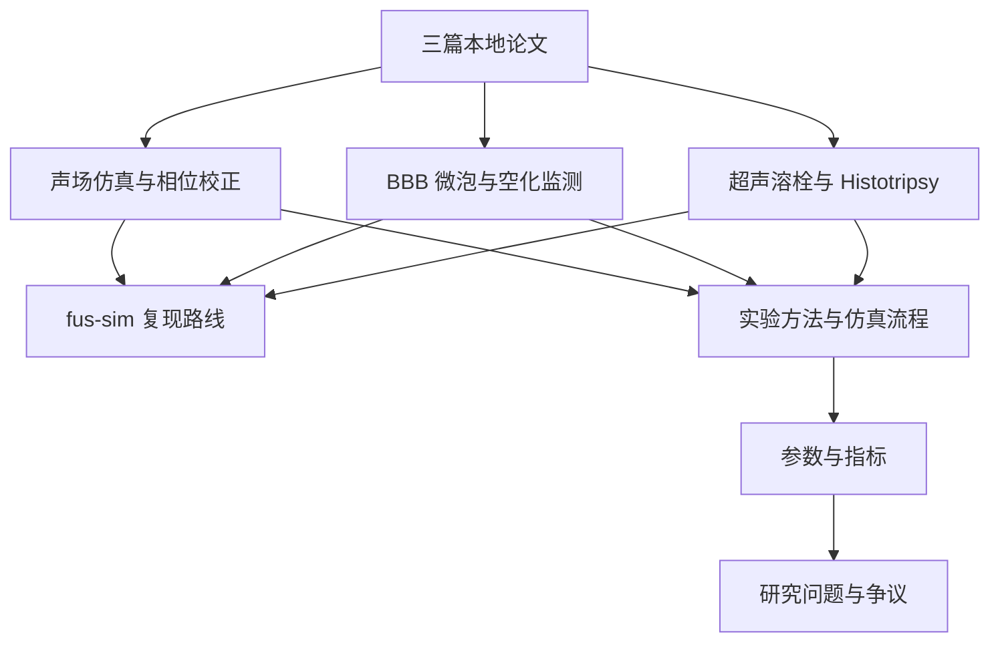

# tFUS Knowledge Vault

这是 `fus-sim` 的经颅聚焦超声文献知识库入口页。建议在 Obsidian 中把 `D:\AIprogram\fus-sim\literature_tFUS_review` 作为一个 Vault 打开。

## 快速入口

- [[00_README|整理说明]]
- [[01_seed_papers_summary|三篇本地论文总结]]
- [[02_selected_papers_matrix|12 篇精选论文矩阵]]
- [[03_experimental_steps|实验步骤/SOP]]
- [[04_theme_synthesis|主题综合]]
- [[MOC_声场仿真与相位校正]]
- [[MOC_BBB微泡与空化监测]]
- [[MOC_超声溶栓与Histotripsy]]
- [[MOC_fus-sim复现路线]]
- [[MOC_实验方法与仿真流程]]
- [[MOC_参数与指标]]
- [[MOC_研究问题与争议]]
- [[05_术语表_零基础版]]
- [[06_系统学习路线]]
- [[07_tFUS文献与公开代码参数对照]]
- [[08_参数对齐报告]]
- [[09_复现路线校准]]
- [[10_学习型论文阅读路线]]
- [[11_已下载学习论文索引]]
- [[12_实验指导型文献清单]]
- [[13_增强搜集补充清单]]
- [[15_全球相似平台与AI替代模型综述]]

## 当前知识体系

## 推荐标签

- `#tFUS`
- `#声场仿真`
- `#相位校正`
- `#kWave`
- `#BBB`
- `#微泡`
- `#空化监测`
- `#溶栓`
- `#热效应`
- `#fus-sim`

## 零基础先读

如果遇到 DICOM、PML、CFL、FDTD、MI、PCD 这类缩写，先看：

- [[05_术语表_零基础版]]
- [[06_系统学习路线]]

建议顺序是：先理解“超声是什么” -> “为什么颅骨会影响聚焦” -> “仿真软件在算什么” -> “声压、温升、空化这些指标代表什么”。

## 使用方式

1. 在 Obsidian 中打开本文件夹作为 Vault。
2. 每次新增论文时，复制 [[templates/paper_note_template|论文笔记模板]] 到 `notes/`。
3. 每次读论文时，把它补到对应主题 MOC，并至少链接一个参数、一个方法或一个研究问题。
4. 遇到容易混淆的概念时，优先更新 [[MOC_参数与指标]] 和 [[05_术语表_零基础版]]。
5. 发现论文之间说法不一致时，补到 [[MOC_研究问题与争议]]。
6. 需要 Codex 帮忙时，直接说“查看 `literature_tFUS_review` 里的 Obsidian 文献库”，Codex 可以读取同一批 Markdown 文件。
